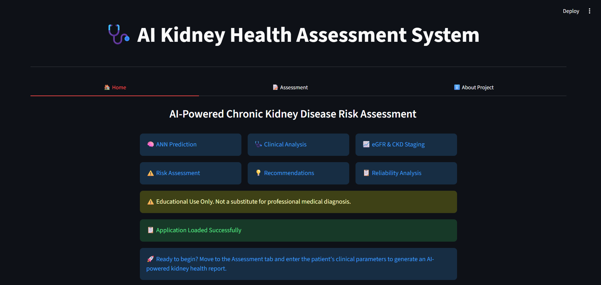
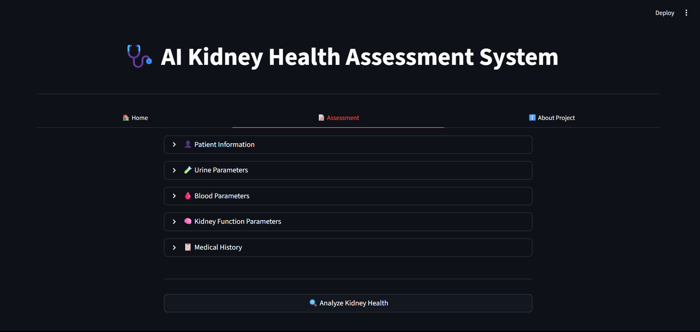
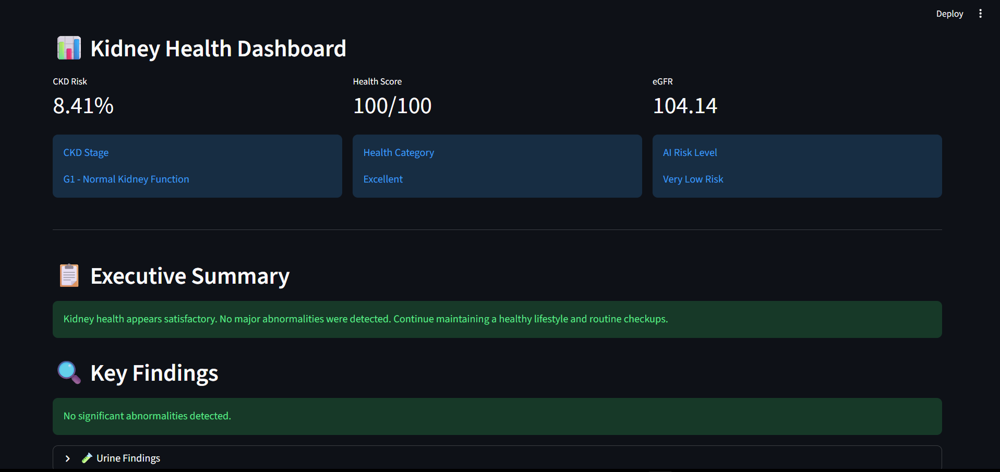
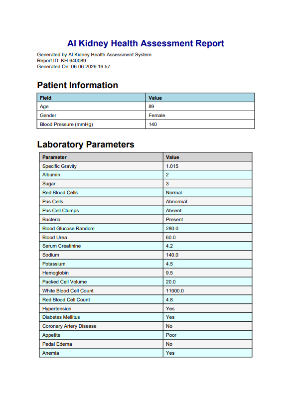

AI Kidney Health Assessment System
Project Overview

The AI Kidney Health Assessment System is an intelligent healthcare analytics application designed to assess Chronic Kidney Disease (CKD) risk using Artificial Intelligence and clinical rule-based analysis.

## Application Screenshots

### Home Page

### Assessment Interface

### Results Dashboard

### PDF Report

The system combines:

Artificial Neural Network (ANN) Prediction
eGFR Calculation
CKD Stage Classification
Clinical Findings Analysis
Reliability Assessment
AI–Clinical Agreement Analysis
Personalized Recommendations
PDF Report Generation

The application is built using Python, TensorFlow, Scikit-Learn, and Streamlit.

Features
AI-Based CKD Prediction

Predicts the probability of Chronic Kidney Disease using a trained Artificial Neural Network.

Kidney Function Assessment

Calculates Estimated Glomerular Filtration Rate (eGFR) and classifies CKD stage.

Clinical Analysis Engine

Analyzes:

Urine Parameters
Blood Parameters
Kidney Function Indicators
Medical Risk Factors
Reliability Assessment

Evaluates prediction reliability and confidence.

AI–Clinical Agreement Analysis

Compares AI prediction with clinical findings to improve interpretability.

PDF Report Generation

Generates a detailed kidney health assessment report including:

Patient Information
Laboratory Parameters
Clinical Findings
Recommendations
Overall Assessment
Technology Stack
Component	Technology
Frontend	Streamlit
Backend	Python
AI Model	TensorFlow / Keras
Machine Learning	Scikit-Learn
Data Processing	Pandas, NumPy
Reporting	ReportLab
Project Architecture
Patient Inputs
      ↓
Data Validation
      ↓
ANN Prediction
      ↓
Clinical Rule Engine
      ↓
eGFR Calculation
      ↓
CKD Stage Classification
      ↓
Reliability Assessment
      ↓
Recommendations
      ↓
PDF Report Generation
Project Structure
AI_Kidney_Health_System/
│
├── app.py
├── kidney_engine.py
├── pdf_generator.py
│
├── ann_model.keras
├── scaler.pkl
│
├── requirements.txt
├── README.md
│
└── screenshots/
Installation

Clone the repository:

git clone <repository-url>

Move into the project directory:

cd AI_Kidney_Health_System

Install dependencies:

pip install -r requirements.txt

Run the application:

streamlit run app.py
Future Scope
Multi-Disease Health Assessment
Cloud Deployment
Electronic Health Record Integration
Explainable AI (XAI)
Mobile Application Support
Developer

Syed Shaheer Hussain

B.Tech Electronics & Communication Engineering

VIT-AP University

AI + Healthcare Analytics Project